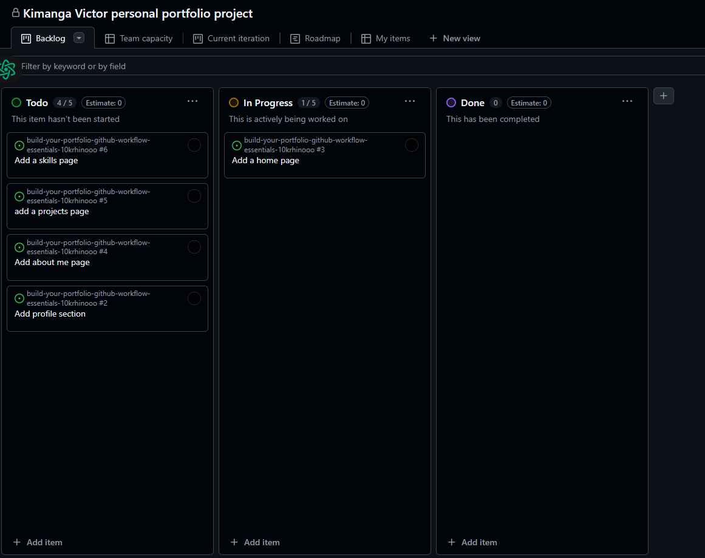
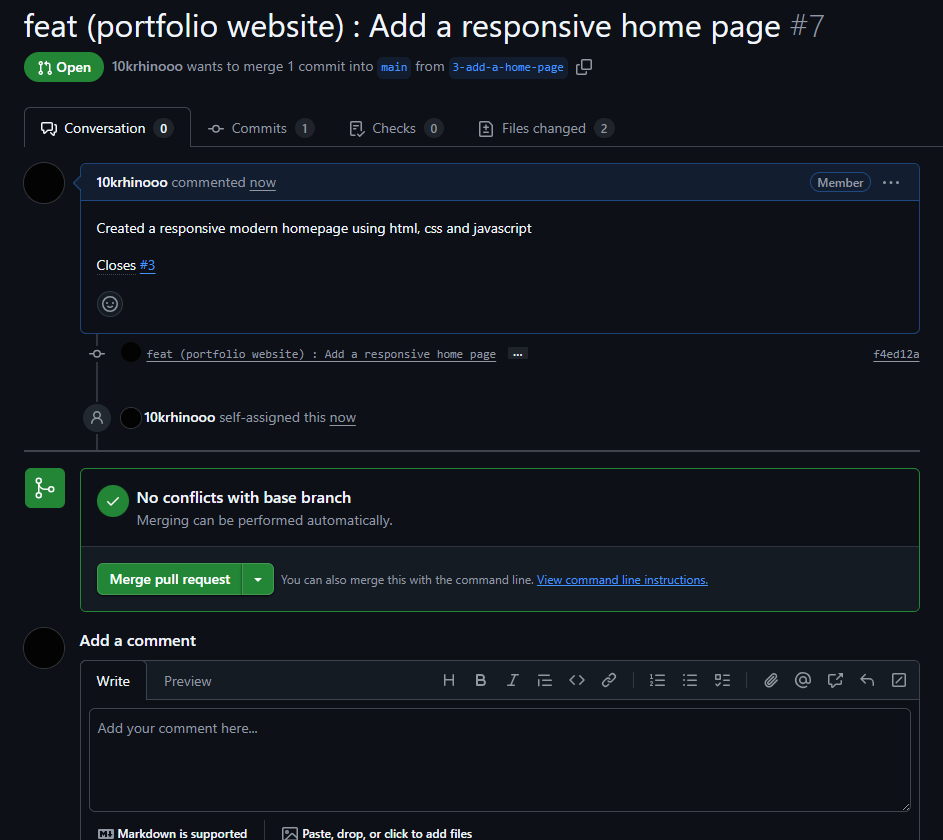

# Personal Portfolio Documentation

## 1. Student Details

- **Full Name**: Kimanga Victor Moruri
- **GitHub Username**:10krhinooo
- **Email**: <vkimanga@gmail.com>

## 2. Deployed Portfolio Link

- **GitHub Pages URL**:  
  _(Provide the live link to your deployed portfolio website)_

## 3. Learnings from the Git Crash Program

List at least **four key concepts or skills** you learned during the Git crash course. For each one, write a brief explanation of how it helped you manage your portfolio project more effectively.

- **Using Milestones and Issues:** Breaking the portfolio into smaller tasks will be easier using GitHub Issues and grouping them into milestones. This helped me keep things under control. It gave me a clear plan of what needed to be done and made the process not feel so daunting.
- **Commit Messages:** Writing clear, descriptive commit messages helped me keep track of the work I did and why. It was easier to understand the project status and debug bugs.
- **Merging:** Being able to merge branches came in handy in merging different features like the contact form and animations without losing any progress and significant conflicts.
- **Deploying Apps with GitHub:** Learning how to deploy my portfolio site with GitHub Pages made it simple for me to easily share a live copy of my work. It was faster and let me test how everything looked and functioned online.

## 4. Screenshots of Key GitHub Features

Include screenshots that demonstrate how you used GitHub to manage your project. For each screenshot, write a short caption explaining what it shows.

### A. Milestones and Issues

- The opened issues of the first Milestone.  

- The closed issues for the first milestone

- last milestone Issues

### B. Project Board

- Includes a picture of my project board with all the issues arranged in their respectful columns  

### C. Branching

- 

### D. Pull Requests

- 

### E. Merge Conflict Resolution

- Screenshot of a resolved merge conflict (in a pull request, commit history, or your local terminal/GitHub Desktop).
