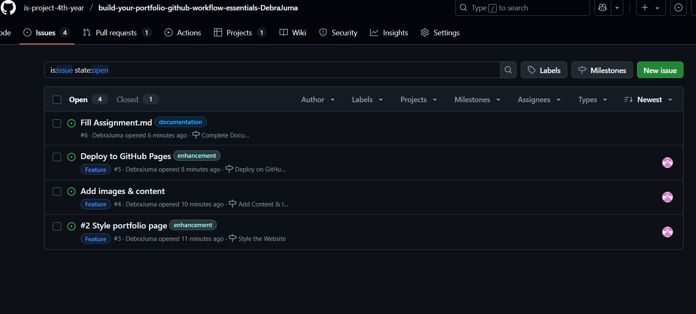

# Personal Portfolio Documentation

## 1. Student Details

- **Full Name**: Debra Juma  
- **Admission Number**: 123456  
- **GitHub Username**: DebraJuma  
- **Email**: debra.juma@strathmore.edu

## 2. Deployed Portfolio Link

- **GitHub Pages URL**:  
  https://is-project-4th-year.github.io/build-your-portfolio-github-workflow-essentials-DebraJuma/

## 3. Learnings from the Git Crash Program

**What I Thought I'd Learn vs What I Actually Learned**

### Concept: GitHub Project Boards

**Expectation 👀**: I thought project boards were meant only for big professional teams working on massive projects.

**Reality 😅**: They turned out to be like simple visual to-do lists where I could track my tasks easily and move them as I progressed.

**Impact 💡**: Helped me stay organized and motivated, especially when building each section of my portfolio step by step.

---

### Concept: Branching

**Expectation 👀**: I expected branching to be unnecessary for one-person projects and only useful when multiple developers are working together.

**Reality 😅**: Branches actually gave me a safe place to try out new designs or content without affecting my main site.

**Impact 💡**: I could confidently experiment with styling or new sections in separate branches, then merge when happy with my changes.

---

### Concept: Pull Requests (PRs)

**Expectation 👀**: I assumed pull requests were overly formal, and only teams needed them for code reviews.

**Reality 😅**: PRs were super useful even solo — they gave me a clear overview of what each branch changed, and a way to merge it cleanly.

**Impact 💡**: Made my workflow much clearer and allowed me to track changes while documenting my progress.

---

### Concept: Merge Conflicts

**Expectation 👀**: I thought merge conflicts would be confusing, and I worried they would break my entire project.

**Reality 😅**: They were actually pretty simple to resolve — GitHub highlighted the conflicts and allowed me to choose what I wanted to keep.

**Impact 💡**: Gave me confidence that I could fix issues myself and continue working smoothly, even if branches overlapped.

---

## 4. Screenshots of Key GitHub Features

### A. Milestones and Issues

### B. Project Board

### C. Branching

### D. Pull Requests

### E. Merge Conflict Resolution

