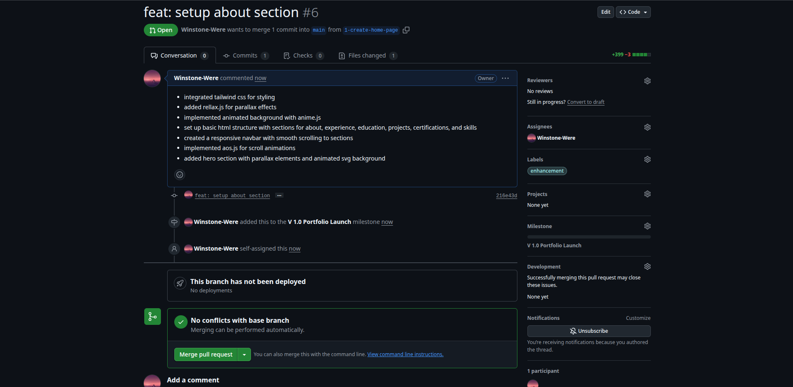

# ✅ Individual GitHub Portfolio Project: Student Checklist
________________________________________

## Project Overview

You are required to create a personal portfolio website and manage your development process using Git and GitHub. This hands-on assignment introduces you to real-world workflows: issue tracking, feature branching, commits, pull requests, milestone setting, and deployment via GitHub Pages.

**Project Duration:** June 9th – 24th , 2025  
**Milestone:** v1.0 Portfolio Launch  
**Deliverables:** GitHub repository link + deployed site link

________________________________________

### 🧭 Setup and Planning 

- Create a public GitHub repository for your portfolio (suggested name: portfolio-username)
- Add a basic README.md with:  
  - Your full name  
  - Project title  
  - GitHub Pages link (once ready)  
- Add a .gitignore file (if needed)  
- Enable GitHub Pages in repo settings  
- Set up milestone v1.0 Portfolio Launch (due June 24)  
- Create 3–5 GitHub Issues for key site sections:  
  - Home Page  
  - About Me / Bio  
  - Projects / Contact Page  
  - Styling / Responsiveness (optional)  
  - Deployment  
- Assign issues to milestone and yourself

________________________________________

### 🛠️ Development Workflow 

#### 📋 Branching and Commits

- For each issue, create a feature branch  
  Example: `git checkout -b feature/home-page`  
- Commit regularly with clear messages referencing issues  
  Example: `feat: add intro section to Home (#1)`  
- Use commit keywords to link and close issues  
  Example: `Closes #2`

#### 🔁 Pull Requests (PRs)

- For every feature, open a Pull Request to `main`  
- Use descriptive titles (e.g., Add Projects Section)  
- In PR body, mention which issue it closes  
- Merge PRs after reviewing and testing locally

________________________________________

### 🌐 Deployment 

- Make sure all features are merged into `main`  
- Deploy the site via GitHub Pages  
  - Settings → Pages → Select main branch  
- Copy the live link into your README.md

________________________________________

### ✅ Final Review & Submission (June 23–24)

| Task                       | Status |
|----------------------------|--------|
| Created GitHub repo        | [ Done]    |
| Set milestone + issues     | [ Done]    |
| README.md written          | [ Done]    |
| Created 3+ feature branches| [ Done]    |
| Linked commits to issues   | [ Done ]    |
| Opened & merged PRs        | [ Done]    |
| Site deployed via GitHub Pages | [ Done] |
| Deployment link added to README.md | [ Done] |
| Milestone progress at 100% | [ Done ]    |

________________________________________

### ✨ Optional Extras (Bonus Points)
 
 - Add screenshots of your site in README.md  
- Write a REFLECTION.md (what you learned)  
- Customize CSS styles creatively  
- Use at least one image/icon in your portfolio  
- Use a favicon for your site

________________________________________

### 📅 Weekly Breakdown (for guidance)

| Week          | Focus Area                                |
|---------------|------------------------------------------|
| June 10–12    | Setup repo, create issues, branching plan|
| June 13–15    | Build Home, About sections + commit workflow|
| June 16–18    | Build Projects section, styling, images  |
| June 19–20    | Final polish, contact section, icons     |
| June 21–22    | Deployment to GitHub Pages                |
| June 23–24    | Final review, clean-up, submission        |

________________________________________

### 📬 Submission

- **Due Date:** June 24, 2025  
- **Submit via:** [Insert Google Form / LMS / Email]

________________________________________

### 📋 How to Update This README

As you work on your portfolio, please update this README.md file with the following details:

- **Your deployed portfolio link:**  
  Add the URL to your live site on GitHub Pages here.
  🌐 **Live Site**: [winstone-were.github.io/portofolio-winstone-were](https://winstone-were.github.io/portofolio-winstone-were)

- **Screenshots:**  
  Add screenshots or images of your portfolio to showcase your work.  
  Example markdown for adding an image:  

  

  ### Homepage
  

  ### About Me
  

  ### Experience
  

  ### Education
  

  ### Projects
  

  ### Certifications
  

  ### Skills 
  

  ### Contact
  